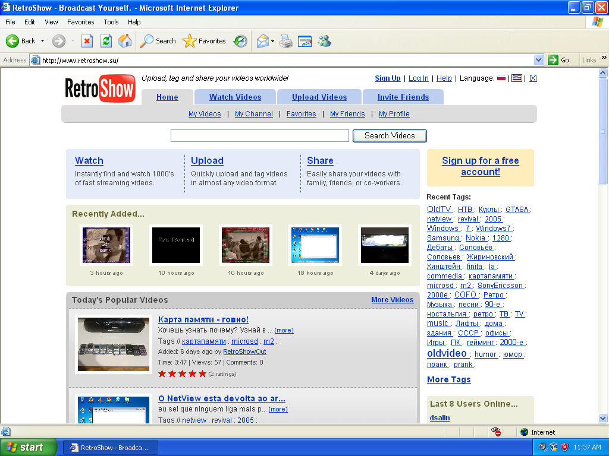

# RetroShow



RetroShow is an engine for creating a video website styled after YouTube as it looked in August 2005. The engine works well in old browsers such as **Internet Explorer 5**. To run it, you will need a web server with PHP, FFmpeg, and Python for the external conversion server.

## Requirements

* **Python 3.8+** (download it from [python.org](https://python.org))
* **FFmpeg** (download it from [ffmpeg.org](https://ffmpeg.org/download.html))
* **A server with PHP support** (for example, [XAMPP](https://www.apachefriends.org/))

## Installation

1. Download and extract the repository into an empty folder on your server.
2. Start the external conversion server with the following command:

```bash
python3 converter/server.py
```

3. That's it!
